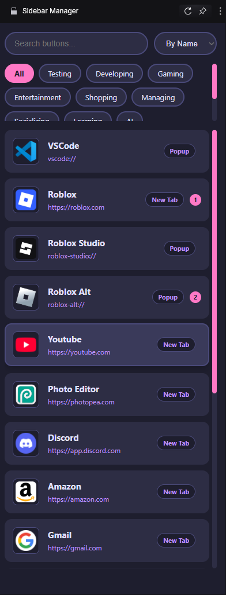

# GX Sidebar Manager

A customizable sidebar extension for Opera GX and Chrome browsers that allows you to manage quick-access buttons with categories, keyboard shortcuts, and flexible opening modes.




## Features

- 🚀 **Quick Access Buttons**: Create and organize your favorite websites as buttons
- 🗂 **Categories**: Organize buttons into customizable categories
- ⌨ **Keyboard Shortcuts**:
  - `Alt+Shift+S`: Open/close sidebar
  - `Alt+1`/`Alt+2`: Quick access to assigned buttons
- 🌈 **Customizable UI**: Mutiple themes matching Opera GX's accent colors 
- 🔄 **Multiple Opening Modes**:
  - New Tab
  - Current Tab
  - Popup Window
- ⚒️ **Cross-Device Sync**: Export/import settings
- 📌 **Drag & Drop**:
  - Reorder buttons
  - Add new buttons from bookmarks or open tabs
- 🖼 **Automatic Favicons**: Automatically fetches icons for your buttons
- ⚡ **Quick Assignment**: Assign buttons to quick-access slots

## Installation

### For users
  1. Add the GX Sidebar Manager extension from the opera store [Extension link](#) *(link currently unavailable)*
### For Testers
1. Download the latest release from the [Releases page](RELEASES.md)
2. In Opera, go to `opera://extensions`
3. Enable "Developer mode"
4. Drag and drop the `.crx` file or load the unpacked extension

### For Developers
1. Clone this repository
2. In Opera, go to `opera://extensions`
3. Enable "Developer mode"
4. Click "Load unpacked" and select the repository folder

## Usage

1. Click the extension icon or use `Alt+Shift+S` to open the sidebar
2. Use the options page to:
   - Add new buttons
   - Create categories
   - Assign quick-access shortcuts
   - Customize button behavior

## Technical Details

- **Manifest Version**: 3
- **Permissions**:
  - `storage` - Save button configurations
  - `tabs` - Interact with browser tabs
  - `bookmarks` - Access bookmarks for drag & drop
  - `sidePanel` - Opera sidebar functionality
  - `webNavigation` - Detect start pages

## File Structure
```
/
├── icons/ - Extension icons in multiple sizes
├── manifest.json - Extension configuration
├── options.html - Options page UI
├── options.js - Options page logic
├── panel.html - Sidebar UI
├── panel.js - Sidebar logic
└── sw.js - Service worker (background script)
```

## Contributing

Contributions are welcome! Please follow these steps:

1. Fork the repository
2. Create a feature branch (`git checkout -b feature/your-feature`)
3. Commit your changes (`git commit -am 'Add some feature'`)
4. Push to the branch (`git push origin feature/your-feature`)
5. Open a Pull Request

## Known Issues

- Sidebar API availability varies by browser
- Favicon fetching may fail on some websites

## License

[MIT License](LICENSE)

---

**Disclaimer**: This extension is Opera GX only. Cross-browser compatibility is yet to be finsihed.
